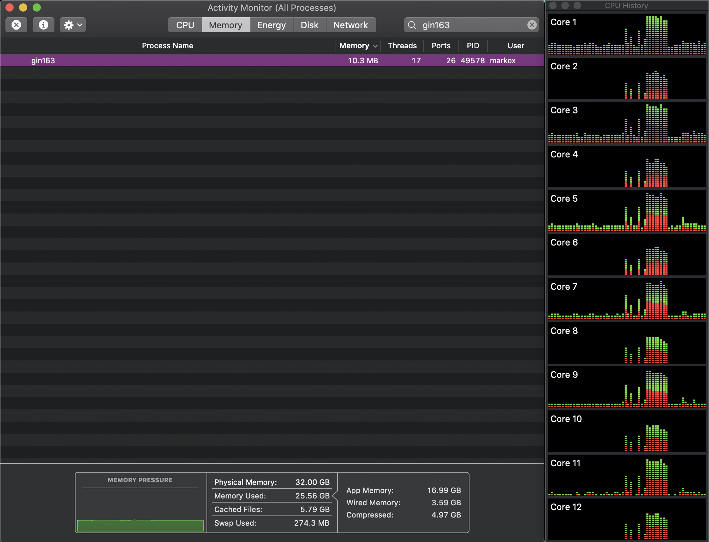
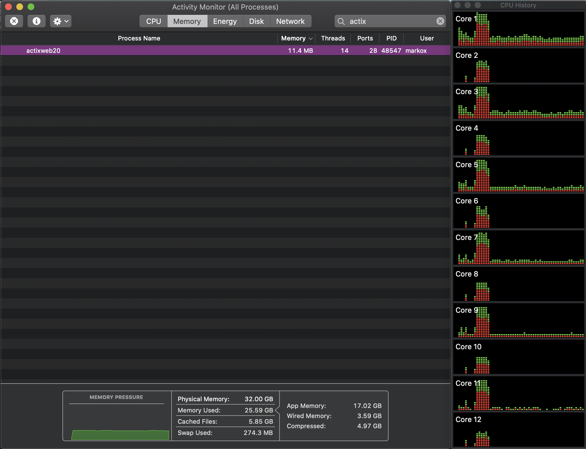

# benchmark Golang vs Rust

This benchmark is based on a load test script for a simple API,
unique endpoint that returns the number of requests it has processed.

## Framework used for Go app: gin-gonic 1.6.3

> Commands to create a project:
>
> mkdir gin163; cd $_
> go mod init gin163

> to build it, export this environment variable
> export GO111MODULES="on"
> go build 

## Framework used for Rust app: activ-web 2.0

> Commands to create a project:
>
> cargo new actixweb20

> to build project
> cargo build --release

## Details

The load test is a bash script and I'm using multiple tools for this:

 - http: https://httpie.org/
 - hey: https://github.com/rakyll/hey
 - wrk: https://github.com/wg/wrk

How it works is:

Always hits `/helloWork` endpoint, it triggers bursts in different sequences

 1. hits once
 2. hits 100k using 100 connections
 3. sleep for 10s
 4. hits 100k using 100 connections
 5. sleep for 10s
 6. hits 100k using 100 connections
 7. sleep for 10s
 8. hits for 30 seconds using 100 connections
 9. hits only once

you can check this [script](load_test.sh)

these are the results for each app:

- [gin163 results](gin163/load_test_result.txt)
- [actixweb20 results](actixweb20/load_test_result.txt)

## Conclusions

Since I did not look for any tool to get profiling data for each app I don't have much information to compare but I'll show screenshots from Activity Monitor app from MacOS

- Both apps keep very low memory consumption with just slightly difference for Go app with ~1Mb less.

- What was very notorious is CPU usage for Go app as you can see in CPU history from screenshot.

- What is really dominant for Rust app is the incredible amount of requests processed, at least 2x versus Go app.

### Total requests:

- Go with Gin 1.6.3: 1,682,359

- Rust with Actix-web 2.0: 3,556,243

# Screenshots:

## Go with Gin

### Gin 1.6.3

## Rust with Actix-web 2.0

### Actix-web 2.0

